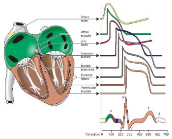
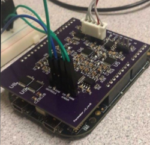

# Pacemaker Project
An app designed to control, monitor, and visualise a pacemaker prototype. 

## Overview
The purpose of this project was to create a system that will help patients needing bradycardia support. This support provides dual chamber, rate adaptive bradycardia pacing support, historical data on performance, and user diagnostics through brady analysis functiions. This is essential a front-to-back complete system consisting of a microcontroller, shield (for pacing and sensing), and a device controller-monitor. 

## Hardware
- FRDM-K64F Microcontroller

## Software
- Python (serial, tkinter)

## Future Improvements
- Quality of life changes
- Sleek design
